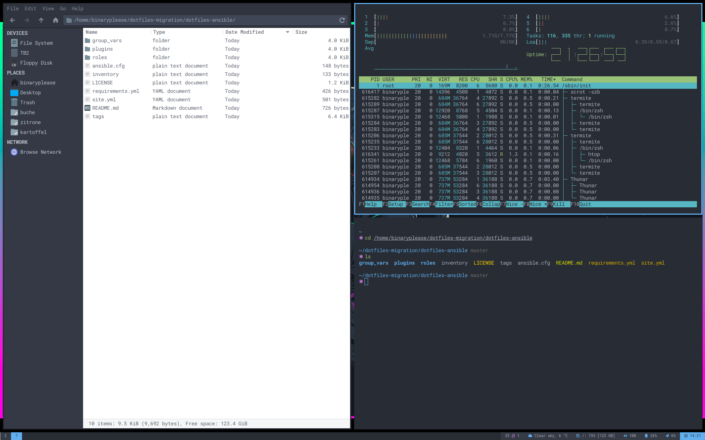

# ansible-i3

This role sets up the i3 [tiling window manager](https://i3wm.org/)

## Dependencies

It is intedend to be used together with
[rofi](https://github.com/binaryplease/ansible-rofi) and
[polybar](https://github.com/binaryplease/ansible-polybar) configuration.

## Arch packages

The following packages are required on Arch:

- i3-gaps
- i3-lock-color
- perl-anyevent-i3
